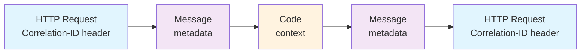

# Project: Correlation ID

In bigger projects, it might make sense to use your own middleware to set the correlation ID.
It should check if the correlation ID is already present in the message's metadata and, if so,
add it to the message's context. Any further requests and messages can then use the same correlation ID.

{{tip}}

`context.Context` is often used to pass arbitrary data between functions.
You shouldn't overuse it, but it works well for passing data that's not directly related to the function's logic.

A good rule of thumb is that the function should work the same way when a `context.Background()` is passed to it.
Keep the values optional.

{{endtip}}

First, retrieve the correlation ID from the message's metadata:

```go
correlationID := msg.Metadata.Get("correlation_id")
```

If it's not present, it's a good idea to generate a new one.
Even if you don't see the full context this way, you can trace at least a part of the request.

```go
if correlationID == "" {
	correlationID = shortuuid.New()
}
```

{{tip}}

If you want to make it more obvious that the correlation ID was missing,
you can add a prefix to the newly generated one, like `gen_`.

{{endtip}}

To add the correlationID to the context, you can use the `log.ContextWithCorrelationID` function from our training's [common package](https://github.com/ThreeDotsLabs/go-event-driven).
Then, set the context on the message, so it's propagated to the handler.

```go
ctx := log.ContextWithCorrelationID(msg.Context(), correlationID)

msg.SetContext(ctx)
```

## Exercise

Exercise path: ./project

**Add end-to-end correlation ID support to the project.**



1. For all messages you publish, propagate the correlation ID from the HTTP `Correlation-ID` header
into the `correlation_id` metadata, like this:

```go
msg.Metadata.Set("correlation_id", c.Request().Header.Get("Correlation-ID"))
```

2. Add middleware to the router to propagate the correlation ID from the message's metadata to its context, as described above.

3. Finally modify the `apiClients` constructor in `main.go`.

Add a *request editor* that propagates the correlation ID from the context to the HTTP request's header.
This function will be called for every HTTP request made.

```go
apiClients, err := clients.NewClients(
	os.Getenv("GATEWAY_ADDR"),
	func(ctx context.Context, req *http.Request) error {
		req.Header.Set("Correlation-ID", log.CorrelationIDFromContext(ctx))
		return nil
	},
)
```

Your correlation ID should now be propagated from incoming HTTP requests,
through the messages, and to the external HTTP calls.

{{tip}}

In your handlers, make sure to pass the `msg.Context()` to the external HTTP calls, like this:

```go
// ...
receiptsService.IssueReceipt(msg.Context())

// ...
spreadsheetsAPI.AppendRow(msg.Context())
```

If you pass `context.Background()`, the correlation ID won't be propagated (because it's not in the context).

{{endtip}}
