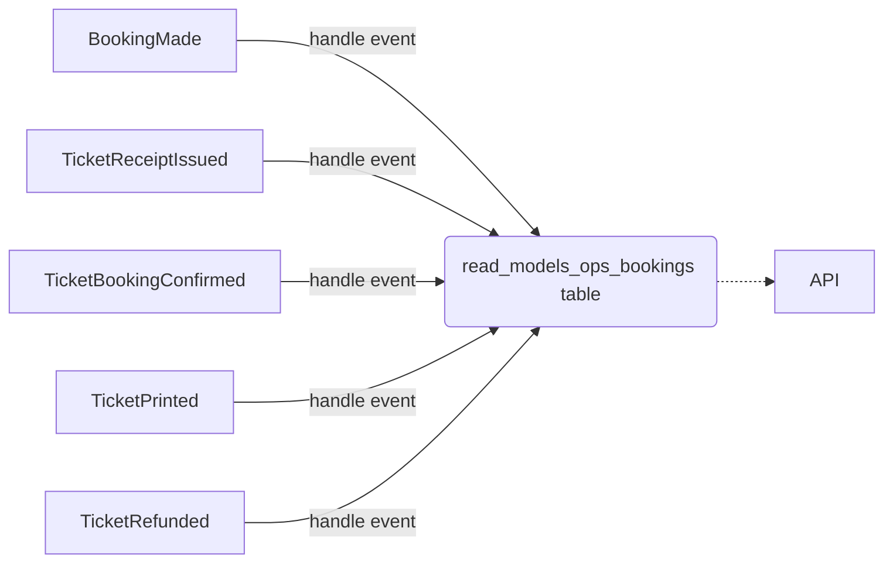

# Project: Storing the Read Model

## Building the Read Model

We prepared a data model you can use for building the read model.

You'll use this struct for both storing the read model in the database and for returning it from the API.

```go
type OpsBooking struct {
	BookingID uuid.UUID `json:"booking_id"`  // from BookingMade event
	BookedAt  time.Time `json:"booked_at"`   // from BookingMade event

	Tickets map[string]OpsTicket `json:"tickets"` // Tickets added/updated by TicketBookingConfirmed, TicketRefunded, TicketPrinted, TicketReceiptIssued

	LastUpdate time.Time `json:"last_update"` // updated when read model is updated
}

type OpsTicket struct {
	PriceAmount   string `json:"price_amount"`   // from TicketBookingConfirmed event
	PriceCurrency string `json:"price_currency"` // from TicketBookingConfirmed event
	CustomerEmail string `json:"customer_email"` // from TicketBookingConfirmed event

	// Status should be set to "confirmed" or "refunded"
	Status string `json:"status"` // set to "confirmed" by TicketBookingConfirmed, "refunded" by TicketRefunded

	PrintedAt       time.Time `json:"printed_at"`       // from TicketPrinted event
	PrintedFileName string    `json:"printed_file_name"`// from TicketPrinted event

	ReceiptIssuedAt time.Time `json:"receipt_issued_at"` // from TicketReceiptIssued event
	ReceiptNumber   string    `json:"receipt_number"`    // from TicketReceiptIssued event
}
```

By now, all the data you need to fill this struct is available in the events.

Note that our "core" model is the booking, and we keep multiple tickets inside it.

Now it's your turn to implement the logic of storing the read model.
You should store your read model in the `read_model_ops_bookings` table, so we can verify your solution.

{{tip}}

It's good to have a prefix for read model tables, so you instantly know that this data is not the source of truth (write model) and is eventually consistent.
Nobody should accidentally write to the read model tables.

Of course, this does not make sense if you use a different database for read models, like Elasticsearch or MongoDB.

{{endtip}}

**You should store the model in the database simply as a JSON.**
Postgres supports a `JSON` column type which is perfect for this use case.

Remember, there's no relational data in the read model — it's a projection of the write model.
Writing to multiple columns would add a lot of unnecessary overhead.

You also shouldn't define any foreign keys. This data is eventually consistent,
and you don't have a guarantee that constraints will be satisfied at the time of the insert.
Often, you'll want to store this data in a different database, likely NoSQL, so you won't be able to define any foreign keys.

We covered this in detail in {{exerciseLink "the first exercise in this module" "13-read-models" "01-read-models"}}.

```sql
CREATE TABLE IF NOT EXISTS read_model_ops_bookings (
    booking_id UUID PRIMARY KEY,
    payload JSONB NOT NULL
);
```

## Implementation tips

#### Helpers

You'll be updating the read model with multiple events.
It's useful to have some helpers to avoid code duplication.

Some events update one ticket within a booking, not the entire booking model.
You should have a helper that hides this logic from you.

Like in {{exerciseLink "the first exercise in the module" "13-read-models" "01-read-models"}},
you can create an `OpsBookingReadModel` struct, that will have a method for each handled event.

```go
func (r OpsBookingReadModel) OnBookingMade(ctx context.Context, bookingMade *entities.BookingMade) error {
	readModel := // ... TODO
	
	err := r.createReadModel(ctx, readModel)
	if err != nil {
		return fmt.Errorf("could not create read model: %w", err)
	}

	return nil
}

func (r OpsBookingReadModel) OnTicketBookingConfirmed(ctx context.Context, event *entities.TicketBookingConfirmed) error {
	return r.updateReadModelByBookingID(
		ctx,
		event.BookingID,
		func(rm entities.OpsBooking) (entities.OpsBooking, error) {
			ticket, ok := rm.Tickets[event.TicketID]
			if !ok {
				// we use the zero-value of OpsTicket
				log.
					FromContext(ctx).
					With("ticket_id", event.TicketID).
					Debug("Creating ticket read model for ticket %s")
			}

			// TODO: you should create a ticket here and add it to the booking
			ticket.PriceAmount = // ...
            ticket.PriceCurrency = // ...
            ticket.CustomerEmail = // ...
			rm.Tickets[event.TicketID] = ticket

			return rm, nil
		},
	)
}
```

{{tip}}

Did you notice that `OnTicketBookingConfirmed` has signature compatible with `cqrs.NewEventHandler`?
You can use it directly in the event processor.

```go
cqrs.NewEventHandler(
	"ops_read_model.OnBookingMade",
	opsReadModel.OnBookingMade,
)
```

{{endtip}}

{{tip}}

If you didn't implement the repository pattern yet, you should check out [our article about the repository pattern in Go](https://threedots.tech/post/repository-pattern-in-go/).

{{endtip}}

{{tip}}

To ensure that you don't lose any updates due to concurrent writes,
you should use `sql.LevelRepeatableRead` isolation level in the transaction used for read model updates.

If you want to learn more about isolation levels, check out this article about [Transaction Isolation Levels With PostgreSQL](https://mkdev.me/posts/transaction-isolation-levels-with-postgresql-as-an-example).

{{endtip}}

#### Out of order events

You may receive events out of order (it's theoretically possible to receive `TicketPrinted` before `TicketBookingConfirmed`).

In such a scenario, you can return an error in the `TicketPrinted` handler (nack the message).
Once `TicketBookingConfirmed` arrives and `TicketPrinted` is redelivered, you'll be able to process it correctly.

#### Testing

You can apply the same testing strategy like when 
{{exerciseLink "testing repositories" "10-at-least-once-delivery" "07-project-testing-idempotency"}}.

## Exercise

Exercise path: ./project

**Implement a read model with the provided structure and store it in the `read_model_ops_bookings` table.**

1. Create the schema for the `read_model_ops_bookings` table.

2. Implement event handlers for the following five events:
- `BookingMade`
- `TicketReceiptIssued`
- `TicketBookingConfirmed`
- `TicketPrinted`
- `TicketRefunded`

Each handler should update the read model accordingly, using its fields.

The operations usually include:
* Get the read model by booking ID or ticket ID.
* Create a new read model if it doesn't exist.
* Update the read model with the new data.

Remember to use transactions to ensure that the read model is updated atomically.


```mermaid
graph LR
  A[BookingMade] -->|handle event| B(read_models_ops_bookings table)
  C[TicketReceiptIssued] -->|handle event| B
  D[TicketBookingConfirmed] -->|handle event| B
  E[TicketPrinted] -->|handle event| B
  F[TicketRefunded] -->|handle event| B
  B -.-> G[API]
```

3. Add the new handlers to the Event Processor.

{{hints}}

{{hint 1}}

Some more helpers may be useful during implementation.

We recommend spending some effort trying to figure it out by yourself.
You'll learn better, and you'll be ready to do the same in other projects!

```go
func (r OpsBookingReadModel) createReadModel(
	ctx context.Context,
	booking entities.OpsBooking,
) (err error) {
	payload, err := json.Marshal(booking)
	if err != nil {
		return err
	}

	_, err = r.db.ExecContext(ctx, `
		INSERT INTO 
		    read_model_ops_bookings (payload, booking_id)
		VALUES
			($1, $2)
		ON CONFLICT (booking_id) DO NOTHING; -- read model may be already updated by another event - we don't want to override
`, payload, booking.BookingID)

	if err != nil {
		return fmt.Errorf("could not create read model: %w", err)
	}

	return nil
}

func (r OpsBookingReadModel) updateReadModelByBookingID(
	ctx context.Context,
	bookingID string,
	updateFunc func(ticket entities.OpsBooking) (entities.OpsBooking, error),
) (err error) {
	return updateInTx(
		ctx,
		r.db,
		sql.LevelRepeatableRead,
		func(ctx context.Context, tx *sqlx.Tx) error {
			rm, err := r.findReadModelByBookingID(ctx, bookingID, tx)
			if errors.Is(err, sql.ErrNoRows) {
				// events arrived out of order - it should spin until the read model is created
				return fmt.Errorf("read model for booking %s not exist yet", bookingID)
			} else if err != nil {
				return fmt.Errorf("could not find read model: %w", err)
			}

			updatedRm, err := updateFunc(rm)
			if err != nil {
				return err
			}

			return r.updateReadModel(ctx, tx, updatedRm)
		},
	)
}

func (r OpsBookingReadModel) updateReadModelByTicketID(
	ctx context.Context,
	ticketID string,
	updateFunc func(ticket entities.OpsTicket) (entities.OpsTicket, error),
) (err error) {
	return updateInTx(
		ctx,
		r.db,
		sql.LevelRepeatableRead,
		func(ctx context.Context, tx *sqlx.Tx) error {
			rm, err := r.findReadModelByTicketID(ctx, ticketID, tx)
			if errors.Is(err, sql.ErrNoRows) {
				// events arrived out of order - it should spin until the read model is created
				return fmt.Errorf("read model for ticket %s not exist yet", ticketID)
			} else if err != nil {
				return fmt.Errorf("could not find read model: %w", err)
			}

			ticket, _ := rm.Tickets[ticketID]

			updatedRm, err := updateFunc(ticket)
			if err != nil {
				return err
			}

			rm.Tickets[ticketID] = updatedRm

			return r.updateReadModel(ctx, tx, rm)
		},
	)
}

func (r OpsBookingReadModel) updateReadModel(
	ctx context.Context,
	tx *sqlx.Tx,
	rm entities.OpsBooking,
) error {
	rm.LastUpdate = time.Now()

	payload, err := json.Marshal(rm)
	if err != nil {
		return err
	}

	_, err = tx.ExecContext(ctx, `
		INSERT INTO 
			read_model_ops_bookings (payload, booking_id)
		VALUES
			($1, $2)
		ON CONFLICT (booking_id) DO UPDATE SET payload = excluded.payload;
		`, payload, rm.BookingID)
	if err != nil {
		return fmt.Errorf("could not update read model: %w", err)
	}

	return nil
}

func (r OpsBookingReadModel) findReadModelByTicketID(
	ctx context.Context,
	ticketID string,
	db dbExecutor,
) (entities.OpsBooking, error) {
	var payload []byte

	err := db.QueryRowContext(
		ctx,
		"SELECT payload FROM read_model_ops_bookings WHERE payload::jsonb -> 'tickets' ? $1",
		ticketID,
	).Scan(&payload)
	if err != nil {
		return entities.OpsBooking{}, err
	}

	return r.unmarshalReadModelFromDB(payload)
}

func (r OpsBookingReadModel) findReadModelByBookingID(
	ctx context.Context,
	bookingID string,
	db dbExecutor,
) (entities.OpsBooking, error) {
	var payload []byte

	err := db.QueryRowContext(
		ctx,
		"SELECT payload FROM read_model_ops_bookings WHERE booking_id = $1",
		bookingID,
	).Scan(&payload)
	if err != nil {
		return entities.OpsBooking{}, err
	}

	return r.unmarshalReadModelFromDB(payload)
}

func (r OpsBookingReadModel) unmarshalReadModelFromDB(payload []byte) (entities.OpsBooking, error) {
	var dbReadModel entities.OpsBooking
	if err := json.Unmarshal(payload, &dbReadModel); err != nil {
		return entities.OpsBooking{}, err
	}

	if dbReadModel.Tickets == nil {
		dbReadModel.Tickets = map[string]entities.OpsTicket{}
	}

	return dbReadModel, nil
}

type dbExecutor interface {
	ExecContext(ctx context.Context, query string, args ...interface{}) (sql.Result, error)
	QueryContext(ctx context.Context, query string, args ...any) (*sql.Rows, error)
	QueryRowContext(ctx context.Context, query string, args ...any) *sql.Row
}
```

{{endhint}}

{{endhints}}
